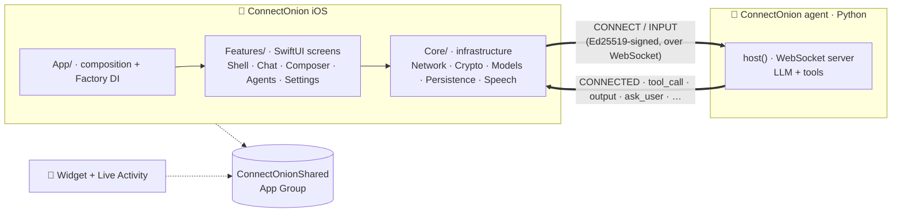

# ConnectOnion iOS

A SwiftUI iOS client for **ConnectOnion agents** — add a local or remote agent, chat with it, and
watch tool calls, approvals, attachments, and execution status stream back in real time.

The app is one end of a protocol; a [`connectonion`](https://github.com/openonion/connectonion)
Python agent is the other. They speak the same wire language: an **Ed25519-signed handshake over a
WebSocket**, then a stream of typed events.

`iOS 26+` · `Swift 6.2 / SwiftUI` · `SwiftData` · `Factory DI` · `CryptoKit (Ed25519)`

## Architecture



**Layering (one-directional):** `Features` depend on `Core`; `Core` never imports `Features` or
SwiftUI. Every service seam is a `protocol + concrete + mock` triad wired through Factory, so views
and view models are fully testable against mock networking, identity, and transport.

## Project structure

```text
ConnectOnion iOS/            # the app target
├─ App/                      # @main entry + Factory dependency registrations
├─ Core/                     # infrastructure — no SwiftUI, no Features
│  ├─ Network/
│  │  ├─ Transport/          # WebSocket transport (+ protocol + mock)
│  │  ├─ Client/             # ConnectOnionClient, ProtocolCodec, ServerEvent, wire DTOs
│  │  └─ Directory/          # agent discovery + routing (direct / relay)
│  ├─ Crypto/                # Ed25519 identity, Keychain store, signing
│  ├─ Models/                # domain types — Agent/ and Chat/
│  ├─ Persistence/           # SwiftData @Model records
│  ├─ ChatLogic/             # ChatEventReducer (pure, UI-free, testable)
│  ├─ Speech/                # voice dictation (SFSpeechRecognizer)
│  ├─ SystemIntegrations/    # ActivityKit Live Activity controller
│  └─ Support/               # small utilities + preview fixtures
├─ Design/                   # shared styling (Liquid Glass, motion)
└─ Features/                 # one folder per product area
   ├─ Shell/                 # app shell, sidebar, navigation
   ├─ Chat/                  # chat screen + Cards/ + Timeline/ (one view per message kind)
   ├─ Composer/              # message composer shared by Chat + Agents
   ├─ Agents/                # agent landing, editor, profile
   └─ Settings/

ConnectOnionShared/          # App-Group types shared with the widget
ConnectOnionWidget/          # home-screen widget + Live Activity
Config/                      # Info.plists + entitlements
scripts/                     # run_e2e.sh — one-command real-agent E2E
```

## Requirements

- **Xcode 26** (iOS 26 SDK) on macOS
- An iOS 26 simulator or device

## Getting started

1. Open `ConnectOnion iOS.xcodeproj` in Xcode 26.
2. Select the **ConnectOnion iOS** scheme and an iOS 26 simulator.
3. Build & run with `Cmd + R`.

To connect to a real agent, host one with the Python framework (`pip install connectonion`,
`co auth`, then `host()`), and add its `0x…` address + endpoint in the app.

## Testing

| Suite | What | How |
|---|---|---|
| Unit (`ConnectOnion iOSTests`) | logic — protocol codec, event reducer, view models, attachments, deep links | `Cmd + U`, or `xcodebuild test` |
| UI (`ConnectOnion iOSUITests`) | mock-seeded UI flows (`--ui-testing`) | `Cmd + U` |
| E2E (`ConnectOnion_iOSE2ETests`) | the **real** app ↔ live agent round-trip (skips in CI) | `./scripts/run_e2e.sh` — see [`scripts/README.md`](scripts/README.md) |

CI (`.github/workflows/ios-tests.yml`) runs the unit + UI suites on every push; the E2E test skips
there because it needs a live agent.
